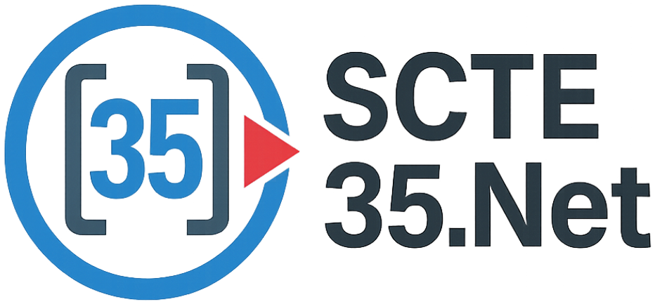

# Scte35.Net



A .NET 8 library for parsing and generating SCTE‑35 cue messages, adapted to idiomatic C# with guardrails around binary parsing and validation.

Based in part on Comcast's [scte35-go](https://github.com/Comcast/scte35-go), with C#/.NET adaptations and additional validation.

- Source: `src/Scte35.Net`
- Tests: `tests/Scte35.Net.Tests`
- License: MIT

## Features

- Decode/encode SCTE‑35 `splice_info_section` to/from bytes, Hex, and Base64.
- High-level helpers: `FromHex`, `FromBase64`, `TryDecode`, `ToHex`, `ToBase64`.
- Commands: SpliceNull, SpliceSchedule, SpliceInsert, TimeSignal, BandwidthReservation, Private (unknown → preserved).
- Descriptors: Avail, DTMF, Segmentation, Time, Audio, plus opaque Private descriptors.
- CRC32 (MPEG‑2) computed/validated via `Crc32Valid`.
- .NET 8 target, nullable enabled.

## Install

- NuGet (package id: `Scte35.Net`):
  - `dotnet add package Scte35.Net`
- From source: open `Scte35.Net.sln`, then `dotnet restore` and `dotnet build`.

## Quick Start

### Decode from Base64/Hex/Bytes

```csharp
using Scte35.Net;
using Scte35.Net.Model;

// Base64
SpliceInfoSection section = Scte35.FromBase64("/DABAAAAAAAAAP/wFAUAAABf+/w==");

// Hex ("0x" prefix optional)
section = Scte35.FromHex("FC300000000000000FFF0140500000017FEFF");

// Raw bytes
if (Scte35.TryDecode(mySpan, out var parsed)) {
    // parsed.SpliceCommandType, parsed.SpliceDescriptors, parsed.Crc32Valid, ...
}
```

### Create a Basic Time Signal and Encode

```csharp
using Scte35.Net;
using Scte35.Net.Model;
using Scte35.Net.Model.Enums;
using Scte35.Net.Model.SpliceCommand;

var section = new SpliceInfoSection {
    SapType = SapType.NotSpecified,
    Tier = 0x0FFF,
    SpliceCommand = new TimeSignalCommand {
        TimeSpecifiedFlag = true,
        // 10 seconds in 90kHz ticks
        PtsTime90K = 10UL * 90_000
    }
};

byte[] wire = Scte35.Encode(section);
string b64 = Scte35.ToBase64(section);
string hex = Scte35.ToHex(section);
```

### Create a Basic Splice Insert (Program Immediate)

```csharp
using Scte35.Net.Model.SpliceCommand;

var insert = new SpliceInsertCommand {
    SpliceEventId = 1,
    OutOfNetworkIndicator = true,
    ProgramSpliceFlag = true,
    SpliceImmediateFlag = true,
    DurationFlag = false,
    UniqueProgramId = 1,
    AvailNum = 0,
    AvailsExpected = 0
};

var msg = new SpliceInfoSection { SpliceCommand = insert };
string insertHex = Scte35.ToHex(msg);
```

## Tests

- Run: `dotnet test -c Release`
- Suite: xUnit; tests mirror source (e.g., `tests/Scte35.Net.Tests/Model/SpliceInsertTests.cs`).
- Focus areas: bit‑exact encode/decode, CRC32 validation, descriptor loops, and edge cases (e.g., 33‑bit PTS masking).
- Includes conformance/spec vector coverage under `tests/Scte35.Net.Tests/Conformance`.

## Advanced

- Private Commands: pass a recognizer to skip unknown PrivateCommand identifiers during decode:
  `Scte35.FromHex(hex, privateId => privateId == 0x43554549 /* CUEI */);`
- Hex/Base64 helpers are available via `Scte35.ToHex/ToBase64` and `Bytes` utilities.

## Contributing

Use Conventional Commits; include tests for new behavior. Ensure `dotnet build` and `dotnet test` pass locally. CI builds, tests, and packs.
